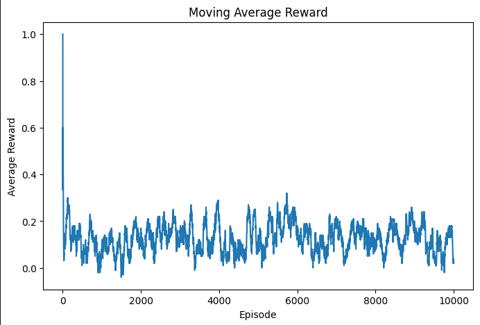
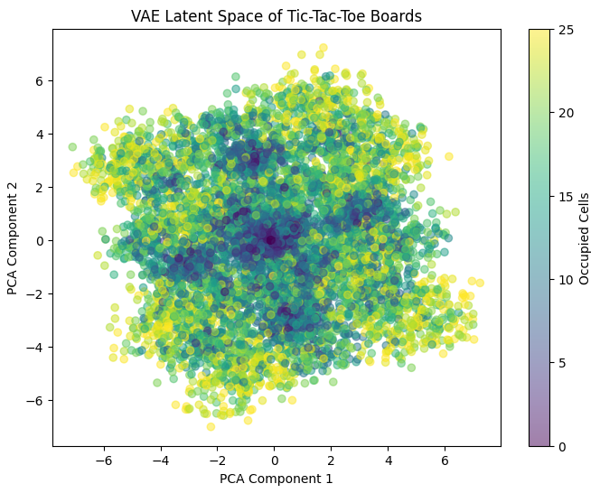

# Artificial Intelligence Assignment

This assignment demonstrates an extension of generalized Tic-Tac-Toe from Dynamic Programming methods
`(Policy Iteration and Value Iteration)` to model-free Reinforcement Learning, specificly Q-Learning method.

Given an agent that learns to play on a nxn board, and a generalized winning condition:

    A player wins by forming a line of length k using their marks in any of the standard Tic-Tac-Toe directions,
    i.e., horizontally, vertically, or diagonally (both main diagonal directions)

the task is to extend the tabular approach by incorporating representation learning through a Variational Auto-Encoder (VAE)
that learns compact latent embeddings of board states, enabling improved generalization to unseen configurations.

## Packages

- numpy
- random
- matplotlib
- scikit-learn
    - train_test_split
    - PCA
- tensorflow
    - keras
        - layers
        - model

## Documentation
### Definition of the Q-table

On my Tic-Tac-Toe environment, the Q-table is initially empty and is being used as a dictionary.
Matrix size is determined by the user (user being prompted to input matrix size).

### Hyperparameters Used
Hyperparameters for this program are listed below:

    alpha = 0.1
    gamma = 0.95
    epsilon = 0.1

### Board and state description
The board is represented in zeros. Its state is first encoded in zeros.
Then, it is utilized in a value of 0.5 regardless of the board size determined by the player.

### Available and best actions
Available actions bypass each loop on certain for-loop instructions, covering board size.
They are chosen through the Q-table; in case multiple actions have the same value, best actions table is empty.
Therefore, a random value represents best actions.

### Moves
Moves are made based on action, player (either Player X or Player Y) and board, regardless which player's turn it is.
The game randomly decides the turn of each player.

### Winner Check
Winner is checked based on board directions:

    (0,1), horizontal
    (1,0), vertical
    (1,1), diagonal \
    (1,-1), diagonal /

If the board is different from the player, the game continues and passes the board's rows and columns.

### Playing the Game
The game starts with a game-over state, set to False, as well as a function used for board creation.
While the game has not ended, it moves into a sequence of steps.

- create board
- encode state
- get available actions
- choose action
- check winner
- check draw
- get random opponent
- update Q-table with new data

### Minimax Testing
Regardless of the board size, minimax testing requires a total of 10000 episodes for the game to run.

### Variational Auto-Encoder
A variational auto-encoder is created. It stores dataset states and collects game states based on 5000 game episodes.
Process is similar to playing the game.

- create board
- get available actions
- get random action choice
- check winner
- check draw
- collect game state(s)

Encoded states are boards first converted into vectors. Then, vectors are converted into a numpy array.

### Train-Test Split
For the variational auto-encoder to work properly, a train-test split is required. It is performed twice:
- train-test split between X_train and X_temp
- train-test split between X_val (validation) and X_test

After training, each X value (X_train, X_val, X_test) is converted into float.

### Encoder Building
After train-test splitting, an encoder is built to sample the epsilon value.
Later, it reparametrizes the model and applies reparametrization into the model.

### Decoder Building
After encoding, a decoder is built. Its model stores the decoder input and output.

### Variational Auto-Encoder Recreation
A variational auto-encoder is recreated and does not follow previous processes as the initial variational auto-encoder.
It is later compiled and trained using 50 epochs for the fitting process.

## Results

### n-dimensions and winning length k being the same number

On a table of 5x5 dimensions, the alpha, gamma and epsilon parameters intended for learning have been pre-set to a default value of:

    alpha = 0.1
    gamma = 0.95
    epsilon = 0.1

each.

Each player is represented by a value, as in the example below.

    empty player is set to 0
    player for X values is set to 1
    player for Y values is set to -1

The board initially is being created with all its values set to zero.

    (0, 0, 0, 0, 0, 0, 0, 0, 0, 0, 0, 0, 0, 0, 0, 0, 0, 0, 0, 0, 0, 0, 0, 0, 0)

Each board has a state, which has been encoded.
In the current example, table state has been set to 0.

    (0, 0, 0, 0, 0, 0, 0, 0, 0, 0, 0, 0, 0, 0, 0, 0, 0, 0, 0, 0, 0, 0, 0, 0, 0)

as well as actions of each player.

    [(0, 0), (0, 1), (0, 2), (0, 3), (0, 4), (1, 0), (1, 1), (1, 2), (1, 3), (1, 4), (2, 0), (2, 1), (2, 2), (2, 3), (2, 4), (3, 0), 
    (3, 1), (3, 2), (3, 3), (3, 4), (4, 0), (4, 1), (4, 2), (4, 3), (4, 4)]

A random opponent has been generated, based on actions from the table.

    (4, 2)

The number of learned state-action pairs on a 5x5 matrix as in the current example, is 102836.

The first 10 learned state-action pairs have been inspected successfully.
While most state-action pairs have values set to 0 (0.0), the first pair has a value set to 2e-323.

    ((0, 0, 0, 0, 0, 0, 0, 0, 0, 0, 0, 0, 0, 0, 0, 0, 0, 0, 0, 0, 0, 0, 0, 0, 0), (0, 0)) : 2e-323
    ((1, 0, 0, 0, 0, 0, 0, 0, 0, 0, 0, 0, 0, 0, 0, 0, 0, -1, 0, 0, 0, 0, 0, 0, 0), (3, 0)) : 0.0
    ((1, 0, 0, 0, 0, 0, -1, 0, 0, 0, 0, 0, 0, 0, 0, 1, 0, -1, 0, 0, 0, 0, 0, 0, 0), (0, 2)) : 0.0
    ((1, 0, 1, 0, 0, 0, -1, 0, 0, -1, 0, 0, 0, 0, 0, 1, 0, -1, 0, 0, 0, 0, 0, 0, 0), (4, 1)) : 0.0
    ((1, 0, 1, 0, 0, 0, -1, 0, -1, -1, 0, 0, 0, 0, 0, 1, 0, -1, 0, 0, 0, 1, 0, 0, 0), (4, 0)) : 0.0
    ((1, -1, 1, 0, 0, 0, -1, 0, -1, -1, 0, 0, 0, 0, 0, 1, 0, -1, 0, 0, 1, 1, 0, 0, 0), (2, 1)) : 0.0
    ((1, -1, 1, 0, 0, 0, -1, -1, -1, -1, 0, 1, 0, 0, 0, 1, 0, -1, 0, 0, 1, 1, 0, 0, 0), (2, 4)) : 0.0
    ((1, -1, 1, -1, 0, 0, -1, -1, -1, -1, 0, 1, 0, 0, 1, 1, 0, -1, 0, 0, 1, 1, 0, 0, 0), (3, 1)) : 0.0
    ((1, -1, 1, -1, 0, 0, -1, -1, -1, -1, 0, 1, 0, -1, 1, 1, 1, -1, 0, 0, 1, 1, 0, 0, 0), (4, 2)) : 0.0
    ((1, -1, 1, -1, 0, 0, -1, -1, -1, -1, 0, 1, 0, -1, 1, 1, 1, -1, -1, 0, 1, 1, 1, 0, 0), (3, 4)) : 0.0

After playing an episode, rate percentages are calculated based on player, state and available rewards.

    Wins: 259
    Losses: 137
    Draws: 604
    Win Rate: 25.90%
    Loss Rate: 13.70%
    Draw Rate: 60.40%

Encoded state shape after board-to-vector conversion is (66367, 25).

### Train-test split results:

Given a matrix of 5x5 dimensions, winning length k set to 5, the train-test split results are represented below.

    Training: (46456, 25)
    Validation: (9955, 25)
    Testing: (9956, 25)

### Variational Auto-Encoder Results

Given 50 epochs, step duration set to 1 millisecond per step and a batch size set to 128, 
the results of loss and validation loss per epoch are represented below.

    loss: 0.3123 - val_loss: 0.1883
    loss: 0.1760 - val_loss: 0.1720
    loss: 0.1661 - val_loss: 0.1646
    loss: 0.1602 - val_loss: 0.1602
    loss: 0.1551 - val_loss: 0.1553
    loss: 0.1502 - val_loss: 0.1504
    loss: 0.1457 - val_loss: 0.1465
    loss: 0.1415 - val_loss: 0.1425
    loss: 0.1376 - val_loss: 0.1389
    loss: 0.1343 - val_loss: 0.1354
    loss: 0.1309 - val_loss: 0.1319
    loss: 0.1274 - val_loss: 0.1284
    ...
    loss: 0.0092 - val_loss: 0.0092
    loss: 0.0092 - val_loss: 0.0091

The reconstructed test board shape is (9956, 25).

Reconstruction accuracy is 99.97%.

### Latent Space Results

Given a 5x5 matrix and a winning length k set to 5, latent space shape is (9956, 16) on a 5x5 matrix.

Latent 2d space is (9956, 2).

Latent Z-samples shape is (10, 16).

Sampled latent boards shape is (10, 25).

Latent Z-generated shape is (1000, 16).

Generated board shape is (1000, 25).

### Interpolation Results

Given a 5x5 matrix and a winning length k set to 5, interpolated Z shape is (5, 16).

Decoded boards shape is (5, 25).

Interpolation sequence results per step, are represented in matrices of values set to either 0, 1, or -1.

    Step 0
    [[ 1  0  0  0 -1]
    [ 0  1  0  0  1]
    [-1 -1 -1 -1  1]
    [ 1  1  0  1  0]
    [-1  0 -1  0  0]]

    Step 1
    [[ 0 -1  0  1  1]
    [-1 -1  0  1  1]
    [-1 -1 -1  0  1]
    [ 1  0  0  1  1]
    [-1  0 -1  0  0]]

    Step 2
    [[ 0 -1 -1  1 -1]
    [-1  1  0 -1  1]
    [ 0  0  0  0  1]
    [ 0  0  1  0  1]
    [ 0  0 -1 -1  0]]

    Step 3
    [[-1 -1  1  0  0]
    [ 1  0  0 -1  1]
    [ 1  0  1  1  0]
    ...
    [ 1  1  1 -1  0]
    [-1 -1  1 -1  1]
    [ 1  1  0 -1 -1]]

### State Results

Given a 5x5 matrix and a winning length k set to 5, visited states number is 113018. 

Generated states number is 1000, while unseen states number is also 1000.
 
### Validity Results

Given a 5x5 matrix and a winning length k set to 5, validity results feature a certain number of valid boards 
out of the total number of generated boards which is 1000 in this example.

Valid boards number is 365.

Unseen boards number is 365.

Acceptance rate percentage is 36.50%.

### Visual Representation

Moving Average Reward per episode

VAE Latent Space of Tic-Tac-Toe Boards

